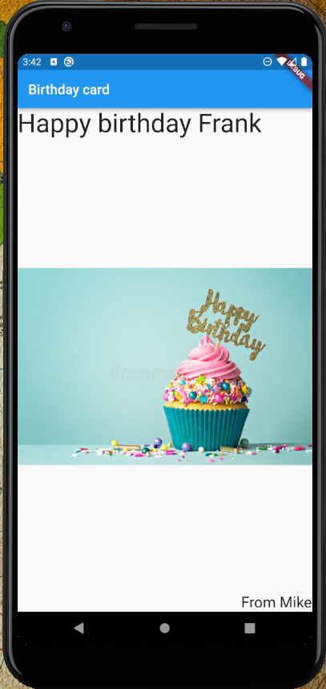
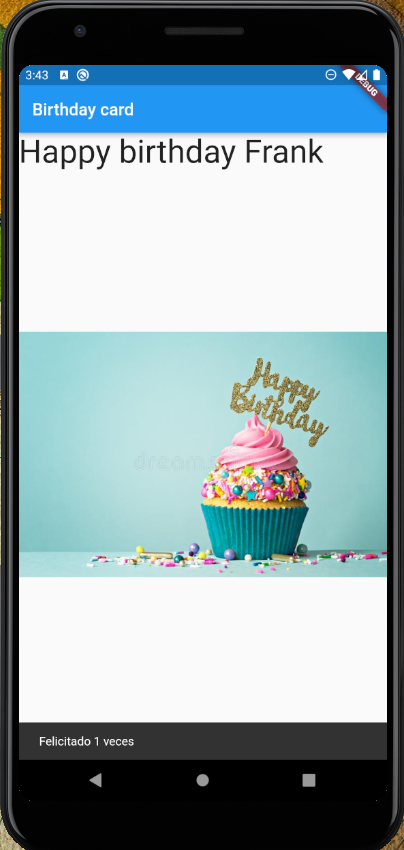

# App 1

App para practicar los siguientes temas:
- Filas, Columnas, Expanded
- Alineacion de elementos
- Imagenes
- Gesture Detector y Snackbars
- Textos y estilos
- Operador cascade y strings interpoladas

## Getting Started

Recuerda que despues de clonar el proyecto, abrir una terminal dentro de la carpeta del proyecto y ejecutar el comando:

```sh
flutter packages get
``` 

## App Screenshot




